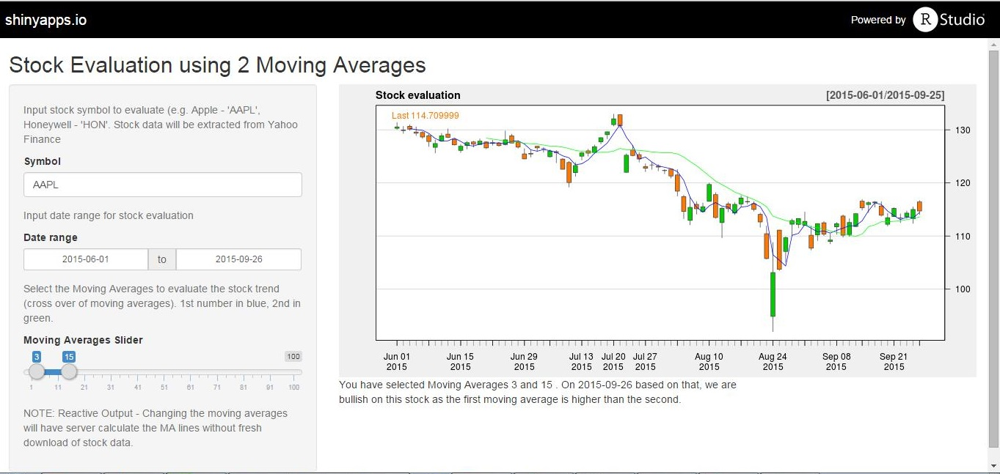
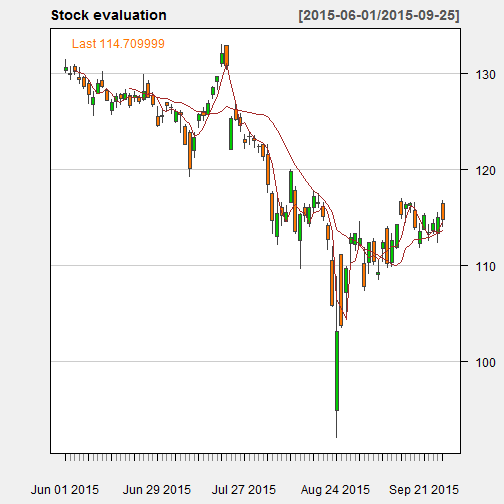

## Introduction (Slide 2/5)

<p>This presentation is demonstrate the usage of Shiny App to generate stock signal and make you a sucessful investor!</p>

<p>Moving averages (division of stock price over time periods by the number of time periods) can be used as indicators for stock prediction. </p>

We will be using the cross over of a shorter moving average to a longer moving average to determine buying (bullish) and selling (bearish) signals.

--- .class #id 

## Screenshot of the Shiny App (Slide 3/5)

This is how the Shiny App looks like and can be found on https://hionghwee.shinyapps.io/stock.

<div style='text-align: center;'>

</div>


--- .class #id 


## Example Plot - non-interactive (Slide 4/5)
<p>Example plot of the app (non-interactive) with Apple stock data from Yahoo Finance and moving averages of 3 and 15 days. </p>

Check out the Shiny App for other stock charts or moving average indicators to get your winning stock signal formula!

```r
library(quantmod); options(getSymbols.warning4.0=FALSE)
data <- getSymbols("AAPL", src = "yahoo", from = "2015-06-01",to = "2015-09-26", auto.assign = FALSE)
chartSeries(data, theme = chartTheme("white"), name = "Stock evaluation", type = "candlesticks", TA= "addSMA(n=3);addSMA(n=15)")
```

 

--- .class #id 


## Conclusion (Slide 5/5)

<p>The App is versatile and you can choose the stock symbol, the time period , and the moving averages you want to evaluate. </p>

<p>The Main Panel of the App will show based on the the moving averages for the latest day (second time period you have chosen), whether to buy or sell the stock. </p>

<p>If the 1st (shorter) moving average is higher than the 2nd (longer) moving average, it is a buy signal and vice-versa.</p>

<p>Thank you for considering this Shiny App and hope you find the winning investment strategy through it. </p>

In investing as always, do remember that past performance does not necessarily predict future results!

--- .class #id 
